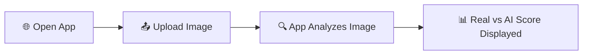

<div align="center">


<br/>


<br/>

🌐 **Live Demo:** [ai-image-verifier.vercel.app](https://ai-image-verifier.vercel.app/)

<a href="https://ai-image-verifier.vercel.app/">

</a>

</div>

<br/>

## 🕵️ About

A web application that detects whether an image is real or AI generated, built with [Next.js](https://nextjs.org) and deployed on Vercel.

<div align="center">

</div>

---

## 🔍 What It Does

Upload any image and the app will analyze it and return a probability score showing how likely the image is real versus AI generated. It provides a quick and easy way to verify the authenticity of images. ✅

<br/>

## 🛠️ Tech Stack

<div align="center">

| Layer | Technology | Icon |
|---|---|---|
| ⚛️ **Framework** | [Next.js](https://nextjs.org) (React framework) | ⚛️ |
| 🔷 **Language** | [TypeScript](https://www.typescriptlang.org/) | 🔷 |
| 🎨 **Styling** | [Tailwind CSS](https://tailwindcss.com/) | 🎨 |
| 🐍 **Backend Script** | Python verification script (`verifier.py`) | 🐍 |
| ▲ **Deployment** | [Vercel](https://vercel.com) | ▲ |

<br/>


&nbsp;

&nbsp;

&nbsp;

&nbsp;


</div>

<br/>

## 🚀 Getting Started

### ✅ Prerequisites

Make sure you have [Node.js](https://nodejs.org/) installed on your machine.

### 📦 Installation

Clone the repository:

```bash
git clone https://github.com/AbdulAzeemHashmi/AI-Image-Verifier.git
cd AI-Image-Verifier
```

Install the dependencies:

```bash
npm install
# or
yarn install
# or
pnpm install
```

### ▶️ Running the Development Server

```bash
npm run dev
# or
yarn dev
# or
pnpm dev
# or
bun dev
```

Open [http://localhost:3000](http://localhost:3000) in your browser to see the app running locally. 🎉

You can start editing the app by modifying `app/page.tsx`. The page auto updates as you save changes.

<br/>

## 📝 How to Use

<div align="center">



</div>

1. 🌐 Open the app in your browser.
2. 📤 Click the upload area to select an image from your device.
3. 📊 The app will analyze the image and display a real versus fake probability score.

<br/>

## 📁 Project Structure

```
AI-Image-Verifier/
├── 📂 app/            # Next.js app directory (pages and components)
├── 📂 public/         # Static assets
├── 🐍 verifier.py     # High accuracy backend verification script
├── 📦 package.json    # Project dependencies and scripts
└── 🔷 tsconfig.json   # TypeScript configuration
```

<br/>

## ☁️ Deployment

This project is deployed using [Vercel](https://vercel.com), the platform built by the creators of Next.js.

<details open>
<summary><b>🚀 Deploy your own instance</b></summary>
<br/>

1. 📤 Push your code to a GitHub repository.
2. 📥 Import the repository on [Vercel](https://vercel.com/new).
3. ⚙️ Vercel will detect Next.js automatically and configure the build settings.
4. 🚀 Click **Deploy**.

</details>

For more details, see the [Next.js deployment documentation](https://nextjs.org/docs/app/building-your-application/deploying).

<br/>

## 📚 Learn More

To learn more about the technologies used in this project:

- 📖 [Next.js Documentation](https://nextjs.org/docs): learn about Next.js features and API.
- 🎓 [Learn Next.js](https://nextjs.org/learn): an interactive Next.js tutorial.
- 🐙 [Next.js GitHub Repository](https://github.com/vercel/next.js): your feedback and contributions are welcome.

<br/>

## 🤝 Contributing

Contributions, issues, and feature requests are welcome. Feel free to open an issue or submit a pull request on [GitHub](https://github.com/AbdulAzeemHashmi/AI-Image-Verifier).

<br/>

## 📄 License

This project is open source and available under the [MIT License](LICENSE).

<br/>

<div align="center">

### ⭐ If you found this project helpful, consider giving it a star

<a href="https://github.com/AbdulAzeemHashmi/AI-Image-Verifier/stargazers">

</a>

<br/><br/>

Made with 💜 by Abdul Azeem, powered by Next.js and a bit of AI detective work.


</div>
